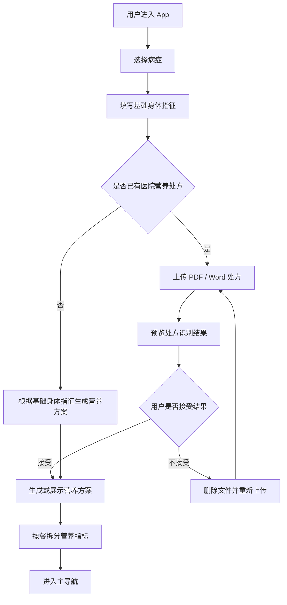
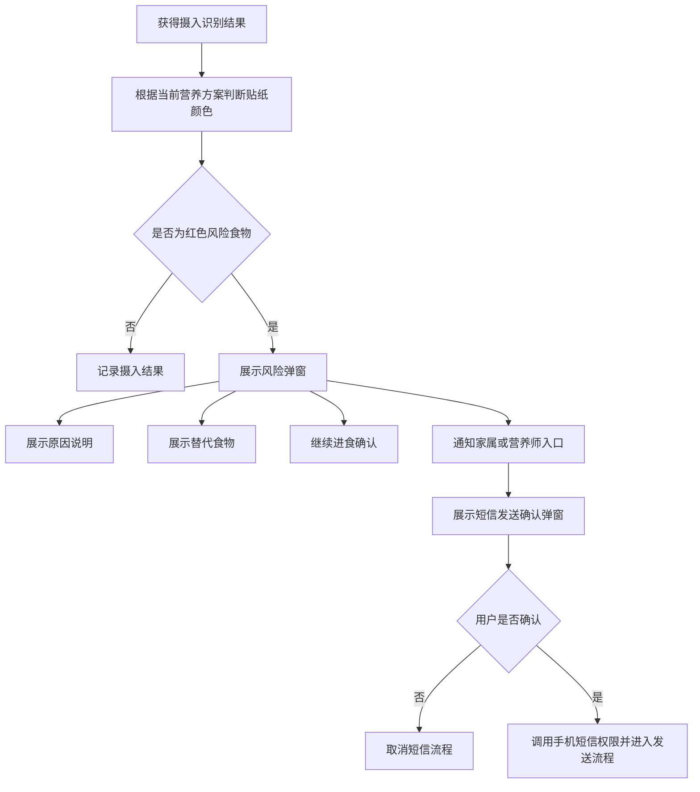
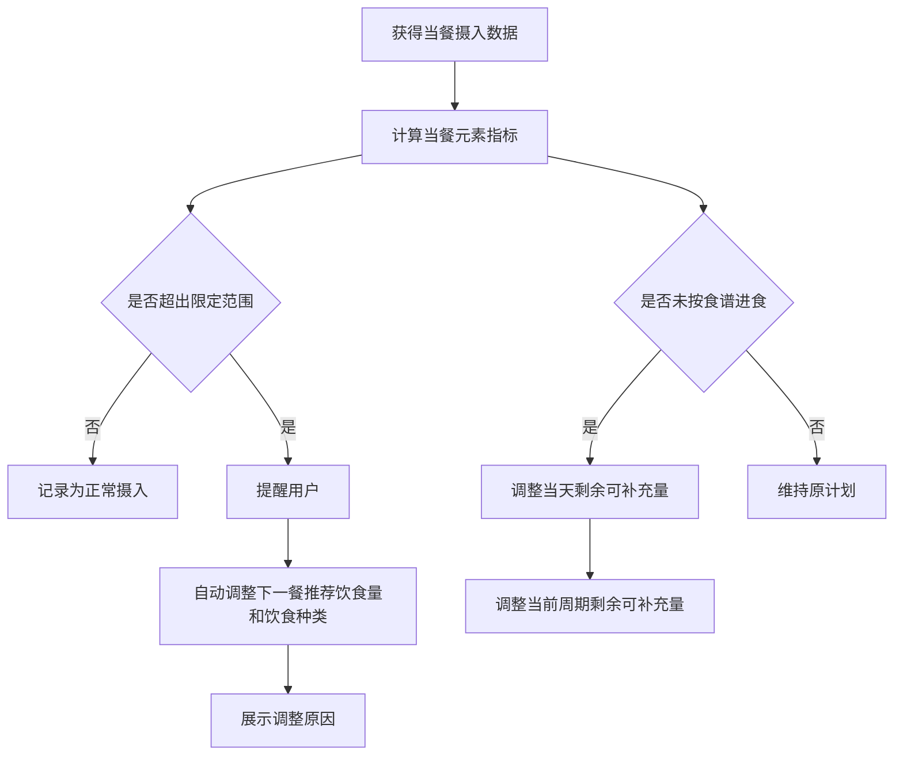
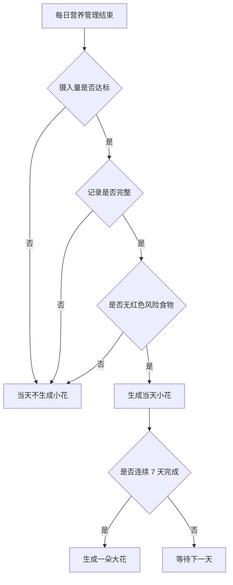

# 慢慢养 App 技术开发文档

## 1. 文档信息

| 项目 | 内容 |
| --- | --- |
| 产品名称 | 慢慢养 |
| 文档类型 | 技术开发文档 |
| 文档用途 | 给开发团队进行技术评估和 Demo 实现拆解 |
| 当前阶段 | Demo 阶段 |
| 需求来源 | `wo-xi/慢慢养需求文档.md` |
| 视觉识别边界 | 摄像头、视觉识别和视觉算法相关内容留白，由算法开发文档定义 |

## 2. 技术边界

### 2.1 本文档包含

1. App 功能模块拆分。
2. 页面与状态设计。
3. 业务流程拆解。
4. 数据对象设计。
5. 接口占位设计。
6. 文件导入流程。
7. 短信通知流程。
8. 报告与图表数据结构。
9. 临时数据生命周期。
10. Demo 阶段包含与不包含的开发范围。
11. 待确认技术问题清单。

### 2.2 本文档不包含

1. 摄像头采集实现。
2. 视觉识别模型实现。
3. 食物克数估算算法。
4. 食物抠图与贴纸生成算法。
5. 视频或图像处理流程。
6. 视觉识别异常场景处理。
7. 食物品类库和特医、特膳产品库建设。
8. 营养规则的医学或算法依据。

以上内容由算法开发文档或营养规则文档定义。

## 3. 已确认技术选型

以下内容已由需求方确认。

| 类型 | 已确认方案 |
| --- | --- |
| App 技术栈 | React Native |
| Demo 运行平台 | iOS 和 Android 双端 |
| 后端形态 | 测试阶段先跑在本地；跑通后通过配置文件写入服务器信息 |
| 数据存储 | 本地 SQLite |
| 鉴权方式 | 手机号登录，支持一键授权和验证码 |
| AI 生成服务 | 真实 AI 生成，调用模型 |
| Agent 对话服务 | 真实 AI 对话，模型选用和令牌配置同 AI 生成服务 |
| 文件解析服务 | 本地解析服务，真实解析 PDF、扫描件 PDF、`.doc`、`.docx` |
| 短信调用方式 | 真实拉起系统短信 |
| 图表实现规则 | 占比类型使用饼状图，对比类型使用柱状图 |
| 部署方式 | 暂时本地呈现，后续需要封装 APK 安装包；iOS 分发暂不处理 |

## 4. AI 模型配置

### 4.1 配置文件要求

营养方案生成和 Agent 对话均调用真实 AI 模型。

项目需要提供一个配置文件模板，供开发者填充模型服务信息和令牌。

配置文件模板：

```text
wo-xi/.env.example
```

开发者本地实际配置文件：

```text
wo-xi/.env
```

`.env` 文件用于填写真实令牌，不应提交到版本库。

### 4.2 配置项

配置项至少包括：

1. 模型服务地址。
2. 模型名称。
3. 模型访问令牌。
4. 营养方案生成使用的模型名称。
5. Agent 对话使用的模型名称。
6. 请求超时时间。
7. 跑通后的服务器地址。
8. 服务器接口前缀。
9. 服务器访问令牌。

当前模板已创建：

```text
wo-xi/.env.example
```

### 4.3 安全约束

Demo 本地阶段可以通过配置文件填充模型令牌。

后续如封装 APK 或接入服务器，不应将模型令牌直接写入 App 包。正式实现应由服务端代管模型令牌，App 通过后端接口调用 AI 能力。

## 5. Demo 功能模块

### 5.1 模块清单

| 模块 | 说明 | Demo 范围 |
| --- | --- | --- |
| 登录与鉴权 | 手机号登录，支持一键授权和验证码 | 包含 |
| 启动与首次配置 | 病症选择、基础身体指征填写 | 包含 |
| 营养方案 | 处方导入、AI 生成方案、方案展示 | 包含 |
| 信息页 | 营养方案、按餐指标、食物贴纸、图例、风险提示 | 包含 |
| 记录页 | 日/周/月摄入图表、反馈、Agent 对话 | 包含 |
| 花园页 | 7 天周期、小花、大花成长反馈 | 包含 |
| 文件导入 | PDF、扫描件 PDF、`.doc`、`.docx` | 包含 |
| 风险弹窗 | 替代食物、原因、继续进食确认、短信通知入口 | 包含 |
| 短信通知 | 紧急联系人、短信权限、二次确认 | 包含 |
| 临时数据管理 | 报告确认后删除，超过 15 分钟删除 | 包含 |
| 摄像头与视觉识别 | 仅保留接口占位 | 留白 |
| 营养师端 | 无 | 不包含 |
| 家属端 | 无 | 不包含 |
| 独立通知提醒 | 无 | 不包含 |

### 5.2 本地运行边界

测试阶段先在本地跑通。

本地阶段需要支持：

1. React Native 双端工程本地运行。
2. 使用 SQLite 本地存储用户基础信息、营养方案、花园进度、报告汇总和 Agent 对话文字。
3. 本地配置 AI 模型服务地址、模型名称和令牌。
4. 本地解析服务完成文件真实解析流程。
5. 本地拉起系统短信。
6. 页面先行开发，后续调用已开发好的接口。

跑通后由需求方提供服务器信息，并通过配置文件写入，再进入服务器接入或部署阶段。

### 5.3 后续交付

当前阶段暂时本地呈现。

后续需要封装 Android APK 安装包。

iOS 安装包、TestFlight 或其他 iOS 分发方式暂不处理。

### 5.4 前端 UI 风格

前端 UI 使用简约风格。

视觉基调：

1. 白色。
2. 米色。

页面开发阶段应保持整体界面干净、轻量、易读，并符合适老化产品定位。

## 6. 页面结构

App 主导航包含 3 个一级页面：

1. 花园
2. 信息
3. 记录

### 6.1 登录页面

登录方式：

1. 手机号一键授权登录。
2. 手机号验证码登录。

登录成功后进入首次配置页面或主导航。

一键授权需要支持国内三大运营商。

验证码有效期为 60 秒。

### 6.2 首次配置页面

首次配置页面不属于主导航页面，但需要在用户首次进入 App 时完成。

页面功能：

1. 选择病症。
2. 填写基础身体指征。
3. 选择是否已有医院营养处方。
4. 进入处方导入路径或 AI 生成方案路径。

### 6.3 花园页

页面功能：

1. 展示当前 7 天周期。
2. 展示每天是否完成营养管理。
3. 用户当天达标后显示一朵小花。
4. 用户连续 7 天达标后显示一朵大花。

当天达标条件：

1. 摄入量达标。
2. 记录完整。
3. 无红色风险食物。

### 6.4 信息页

页面功能：

1. 展示营养方案。
2. 展示按餐拆分的营养指标。
3. 展示食物描边贴纸。
4. 展示贴纸颜色图例。
5. 展示风险提示和动态调整原因。

贴纸颜色：

| 状态 | 颜色 | 色值 |
| --- | --- | --- |
| 符合营养进食 | 草绿色 | `#9DCF55` |
| 一般符合 | 黄色 | `#EFD67C` |
| 非常不符合 | 红色 | `#C82727` |

### 6.5 记录页

页面功能：

1. 展示摄入情况图表。
2. 支持日、周、月维度切换。
3. 占比展示使用饼状图。
4. 对比展示使用柱状图。
5. Agent 主动文字询问用户食谱反馈和身体感受。
6. Agent 支持调整食谱和院外陪伴。

## 7. 业务流程

### 7.1 首次进入流程



### 7.2 文件导入流程

支持文件：

1. PDF
2. 扫描件 PDF
3. `.doc`
4. `.docx`

流程要求：

1. 用户选择文件。
2. 系统上传或读取文件。
3. 系统解析处方内容。
4. 用户预览识别结果。
5. 用户不可修改识别结果。
6. 如果识别不符合预期，用户只能删除后重新上传。

未定义内容：

1. 导入失败提示。
2. 扫描件识别失败处理。
3. 删除后重新上传次数限制。
4. 文件大小限制。
5. 文件是否临时保存及保存时长。

### 7.3 风险食物提示流程



短信通知规则：

1. 用户需要输入紧急联系人。
2. App 调用手机短信权限。
3. Demo 阶段必须弹窗请求用户确认。
4. 用户确认后才允许进入短信发送流程。
5. App 不能直接自动执行短信发送。

### 7.4 动态调整流程



限定范围来源：

1. 医院营养处方。
2. AI 生成方案。

### 7.5 花园成长流程



## 8. 数据对象设计

以下为逻辑数据对象，用于开发评估。

当前阶段使用 SQLite 本地存储。具体 React Native SQLite 库、字段类型和迁移方式由开发实现确认。

### 8.1 UserProfile

| 字段 | 说明 | 状态 |
| --- | --- | --- |
| userId | 用户标识，手机号登录后生成或绑定 | 已定义为需要 |
| phoneNumber | 手机号 | 已定义 |
| loginMethod | 登录方式：一键授权 / 验证码 | 已定义 |
| diseaseType | 病症类型 | 已定义 |
| diseaseOtherText | 其他病症填写内容 | 已定义 |
| weight | 体重，国际单位 | 已定义 |
| height | 身高，国际单位 | 已定义 |
| age | 年龄 | 已定义 |
| gender | 性别 | 已定义 |
| allergyHistory | 过敏史 | 已定义 |
| diseaseHistory | 疾病史 | 已定义 |
| workIntensity | 工作强度，低/中/高 | 已定义 |
| emergencyContactName | 紧急联系人姓名 | 已定义为需要，但字段细节待确认 |
| emergencyContactPhone | 紧急联系人手机号 | 已定义为需要，但字段细节待确认 |

病症类型枚举：

1. `diabetes`
2. `hypertension`
3. `internal_postoperative_recovery`
4. `tumor_recovery`
5. `other`

工作强度枚举：

1. `low`
2. `medium`
3. `high`

### 8.2 NutritionPlan

| 字段 | 说明 | 状态 |
| --- | --- | --- |
| planId | 营养方案标识 | 待确认 |
| userId | 用户标识 | 待确认 |
| sourceType | 方案来源：处方导入 / AI 生成 | 已定义 |
| dailyGoal | 每日总目标 | 已定义 |
| mealSuggestions | 每餐建议 | 已定义 |
| recipes | 食谱 | 已定义 |
| nutrientTargets | 营养素目标 | 已定义 |
| forbiddenFoods | 禁忌食物 | 已定义 |
| supplementSuggestions | 补充剂建议 | 已定义 |
| mealBreakdown | 按餐拆分营养指标 | 已定义 |
| createdAt | 创建时间 | 待确认 |
| updatedAt | 更新时间 | 待确认 |

方案来源枚举：

1. `hospital_prescription`
2. `ai_generated`

### 8.3 NutrientTarget

| 字段 | 说明 | 状态 |
| --- | --- | --- |
| energyKcal | 能量，单位 kcal | 已定义 |
| proteinG | 蛋白质，单位 g | 已定义 |
| fatG | 脂肪，单位 g | 已定义 |
| carbohydrateG | 碳水化合物，单位 g | 已定义 |
| dietaryFiber | 膳食纤维 | 单位按国际认可度最高标准，具体待营养规则确认 |
| calcium | 钙 | 单位按国际认可度最高标准，具体待营养规则确认 |
| magnesium | 镁 | 单位按国际认可度最高标准，具体待营养规则确认 |
| vitamin | 维生素 | 单位按国际认可度最高标准，具体待营养规则确认 |

### 8.4 MealRecord

| 字段 | 说明 | 状态 |
| --- | --- | --- |
| mealRecordId | 当餐记录标识 | 待确认 |
| userId | 用户标识 | 待确认 |
| planId | 营养方案标识 | 待确认 |
| mealType | 餐次：早餐 / 午餐 / 晚餐 | 已定义 |
| intakeItems | 摄入项列表 | 已定义为需要 |
| nutrientActual | 当餐实际营养指标 | 已定义 |
| nutrientTarget | 当餐目标营养指标 | 已定义 |
| isOverRange | 是否超出限定范围 | 已定义 |
| adjustmentReason | 调整原因 | 已定义 |
| createdAt | 记录时间 | 已定义 |

餐次枚举固定为：

1. 早餐
2. 午餐
3. 晚餐

### 8.5 IntakeItem

| 字段 | 说明 | 状态 |
| --- | --- | --- |
| itemId | 摄入项标识 | 待确认 |
| itemName | 品类名称 | 已定义 |
| itemType | 食物 / 特医产品 / 特膳产品 | 已定义 |
| grams | 克数 | 由视觉识别结果提供 |
| intakeTime | 摄入时间 | 已定义 |
| stickerColor | 贴纸描边颜色 | 已定义 |
| complianceLevel | 符合程度 | 已定义 |
| source | 数据来源 | 待确认 |

符合程度枚举：

1. `compliant`
2. `generally_compliant`
3. `non_compliant`

贴纸颜色枚举：

1. `#9DCF55`
2. `#EFD67C`
3. `#C82727`

### 8.6 GardenProgress

| 字段 | 说明 | 状态 |
| --- | --- | --- |
| cycleId | 7 天周期标识 | 待确认 |
| userId | 用户标识 | 待确认 |
| cycleStartDate | 周期开始日期 | 已定义为 7 天周期需要 |
| dayIndex | 周期内第几天 | 已定义 |
| intakeQualified | 摄入量是否达标 | 已定义 |
| recordComplete | 记录是否完整 | 已定义 |
| hasRedRiskFood | 是否存在红色风险食物 | 已定义 |
| smallFlowerEarned | 是否生成小花 | 已定义 |
| bigFlowerEarned | 是否生成大花 | 已定义 |

### 8.7 ReportData

| 字段 | 说明 | 状态 |
| --- | --- | --- |
| reportId | 报告标识 | 待确认 |
| userId | 用户标识 | 待确认 |
| rangeType | 日 / 周 / 月 | 已定义 |
| nutrientSummary | 营养素摄入汇总 | 已定义 |
| pieChartData | 占比图数据 | 已定义 |
| barChartData | 对比图数据 | 已定义 |
| generatedAt | 报告生成时间 | 已定义 |
| confirmedAt | 用户确认时间 | 已定义为数据删除触发条件 |

周期维度枚举：

1. `day`
2. `week`
3. `month`

### 8.8 AgentMessage

| 字段 | 说明 | 状态 |
| --- | --- | --- |
| messageId | 消息标识 | 待确认 |
| userId | 用户标识 | 待确认 |
| sender | 用户 / Agent | 已定义 |
| content | 文字内容 | 已定义 |
| messageType | 食谱反馈 / 身体感受 / 调整食谱 / 陪伴 | 已定义 |
| createdAt | 创建时间 | 待确认 |

Agent 能力限制：

1. 主动文字询问食谱反馈。
2. 主动文字询问身体感受。
3. 调整食谱。
4. 院外陪伴。

Demo 阶段不扩展其他能力。

### 8.9 TemporaryRecognitionData

视觉相关原始数据结构由算法文档定义。

产品侧仅约束数据生命周期：

| 字段 | 说明 | 状态 |
| --- | --- | --- |
| tempDataId | 临时数据标识 | 待确认 |
| userId | 用户标识 | 待确认 |
| linkedReportId | 关联报告标识 | 待确认 |
| createdAt | 创建时间 | 已定义 |
| expiresAt | 过期时间，创建或报告生成后 15 分钟规则需实现 | 已定义 |
| deleteReason | 删除原因：报告确认 / 超时 | 已定义 |

删除规则：

1. 用户确认生成报告后自动删除。
2. 用户未确认报告且超过 15 分钟自动删除。
3. 不长期保存摄像头识别记录。

## 9. 接口占位设计

以下接口为逻辑接口，用于描述模块协作。

当前阶段先开发页面并在本地跑通，后续调用开发好的接口。

本地阶段接口可实现为本地服务、本地函数或本地模块调用。跑通后由需求方提供服务器信息，并通过配置文件写入，再调整为服务端接口。

### 9.1 登录与鉴权

#### 手机号一键授权登录

```http
POST /auth/phone-one-tap
```

说明：

1. 支持手机号一键授权。
2. 需要支持国内三大运营商。
3. 本地 Demo 阶段可先打通页面流程，后续接入具体一键授权服务。

#### 发送验证码

```http
POST /auth/sms-code/send
```

说明：

1. 支持手机号验证码登录。
2. 验证码有效期为 60 秒。
3. 本地 Demo 阶段可先打通页面流程，后续接入验证码发送服务。

#### 验证码登录

```http
POST /auth/sms-code/login
```

请求体字段：

1. 手机号。
2. 验证码。

响应：

1. 用户标识。
2. 登录状态。

### 9.2 用户配置

#### 保存基础信息

```http
POST /user/profile
```

请求体字段：

1. 病症类型。
2. 其他病症文本。
3. 体重。
4. 身高。
5. 年龄。
6. 性别。
7. 过敏史。
8. 疾病史。
9. 工作强度。
10. 紧急联系人姓名。
11. 紧急联系人手机号。

响应：

1. 用户标识。
2. 是否保存成功。

### 9.3 文件导入

#### 上传处方文件

```http
POST /prescriptions/upload
```

支持格式：

1. PDF
2. 扫描件 PDF
3. `.doc`
4. `.docx`

响应：

1. 文件标识。
2. 解析状态。
3. 预览数据。

说明：

1. 文件需要真实解析。
2. 扫描件 PDF 需要真实识别。
3. 文件解析通过本地解析服务实现。
4. 本地阶段先跑通解析流程。
5. 具体解析库、OCR 服务或本地解析工具尚未确认。
6. 导入失败、扫描件识别失败或解析异常时，需要给出用户反馈。

#### 删除处方文件

```http
DELETE /prescriptions/{prescriptionId}
```

说明：

用户不可修改识别结果，只能删除后重新上传。

### 9.4 营养方案

#### 根据处方生成或展示营养方案

```http
POST /nutrition-plans/from-prescription
```

#### 根据基础身体指征生成营养方案

```http
POST /nutrition-plans/generate
```

说明：

1. 营养方案使用真实 AI 生成。
2. AI 模型服务地址、模型名称和令牌通过配置文件填写。
3. 营养指标推荐范围和计算方式待确认。

### 9.5 摄像头与视觉识别接口

本节留白，由算法开发文档定义。

产品侧期望接收的结果字段：

1. 品类名称。
2. 食物 / 特医产品 / 特膳产品类型。
3. 克数。
4. 时间。
5. 可用于计算营养摄入的数据。
6. 可用于判断贴纸颜色的数据。

### 9.6 摄入记录

#### 提交摄入识别结果

```http
POST /intake-records
```

说明：

该接口的数据来源依赖算法文档输出。本文档不定义摄像头或视觉识别细节。

处理逻辑：

1. 记录当餐摄入项。
2. 计算当餐实际营养指标。
3. 判断是否超出限定范围。
4. 判断是否触发红色风险食物弹窗。
5. 如需调整，生成下一餐调整建议。
6. 如未按食谱进食，调整当天和当前周期剩余可补充量。

### 9.7 风险提示

#### 获取风险提示内容

```http
GET /risk-alerts/{intakeItemId}
```

响应字段：

1. 风险原因。
2. 替代食物。
3. 是否允许继续进食确认。
4. 是否展示短信通知入口。

#### 短信通知确认

```http
POST /sms/confirm
```

说明：

1. 调用前必须展示确认弹窗。
2. 用户确认后才允许进入短信发送流程。
3. App 不能直接自动执行短信发送。
4. 确认后真实拉起系统短信。
5. 短信发送动作由用户在系统短信界面完成。

### 9.8 花园进度

#### 获取 7 天周期进度

```http
GET /garden/progress
```

响应字段：

1. 当前周期开始日期。
2. 7 天每日完成状态。
3. 小花状态。
4. 大花状态。

#### 更新当天完成状态

```http
POST /garden/progress/daily-check
```

判断条件：

1. 摄入量达标。
2. 记录完整。
3. 无红色风险食物。

### 9.9 记录与报告

#### 获取图表数据

```http
GET /reports/nutrients?rangeType=day|week|month
```

响应字段：

1. 饼状图数据。
2. 柱状图数据。
3. 营养素汇总。

#### 确认报告

```http
POST /reports/{reportId}/confirm
```

处理逻辑：

1. 标记报告已确认。
2. 删除相关临时识别数据。

### 9.10 Agent 对话

#### 获取 Agent 主动提问

```http
GET /agent/prompts
```

#### 发送用户反馈

```http
POST /agent/messages
```

Agent 范围：

1. 食谱反馈。
2. 身体感受。
3. 调整食谱。
4. 院外陪伴。

说明：

1. Agent 对话使用真实 AI 对话。
2. 模型选用和令牌配置同营养方案生成服务。

## 10. 权限设计

### 10.1 摄像头权限

摄像头权限说明需要告知用户：

1. 用于识别进食和特医、特膳产品摄入行为。
2. 用于估算食物或产品克数。
3. 可能持续捕捉进食全流程。
4. 识别结果用于营养记录、风险提示和方案动态调整。

摄像头具体调用方式、连续捕捉方式和视觉处理流程由算法开发文档定义。

### 10.2 文件选择或上传权限

用途：

1. 上传 PDF 医院营养处方。
2. 上传扫描件 PDF 医院营养处方。
3. 上传 `.doc` 医院营养处方。
4. 上传 `.docx` 医院营养处方。

### 10.3 手机短信权限

用途：

红色风险食物场景下，用户可选择通知紧急联系人。

约束：

1. 必须先弹窗请求用户确认。
2. 用户未确认时不得进入短信发送流程。
3. App 不能直接自动执行短信发送。
4. 用户确认后真实拉起系统短信。
5. 短信发送动作由用户在系统短信界面完成。

## 11. 数据生命周期

### 11.1 长期数据

当前 Demo 阶段使用本地存储。

以下数据在本地保存，用于支撑 Demo 流程：

1. 用户基础身体指征。
2. 营养方案。
3. 花园进度。
4. 报告汇总结果。
5. Agent 对话文字。

后续接入服务器后，以上数据是否迁移到服务端、是否多端同步、是否允许用户清除，需要另行确认。

### 11.2 临时数据

摄像头与视觉识别产生的数据仅在识别过程中到报告生成之前临时保存。

删除触发条件：

1. 用户确认生成报告后自动删除。
2. 用户未确认报告且超过 15 分钟自动删除。

不允许：

1. 长期保存摄像头识别记录。
2. 在未定义授权范围外保存视觉原始数据。

### 11.3 定时删除任务

Demo 阶段需要实现一个临时数据清理机制。

逻辑要求：

1. 查询超过 15 分钟且未确认报告的临时数据。
2. 删除相关临时数据。
3. 记录删除原因。

具体实现方式待技术选型确认。

## 12. 图表数据设计

### 12.1 饼状图

使用场景：

占比展示。

数据结构：

| 字段 | 说明 |
| --- | --- |
| label | 营养指标名称 |
| value | 数值 |
| unit | 单位 |
| percent | 占比 |

### 12.2 柱状图

使用场景：

对比展示。

数据结构：

| 字段 | 说明 |
| --- | --- |
| label | 营养指标名称或日期 |
| targetValue | 目标值 |
| actualValue | 实际值 |
| unit | 单位 |

### 12.3 周期维度

支持：

1. 日
2. 周
3. 月

## 13. Demo 页面状态

### 13.1 文件导入状态

| 状态 | 说明 |
| --- | --- |
| idle | 未选择文件 |
| selected | 已选择文件 |
| uploading | 上传中 |
| parsing | 解析中 |
| preview | 可预览 |
| accepted | 用户接受识别结果 |
| deleted | 用户删除文件 |
| failed | 导入或识别失败 |

失败提示文案未定义。

### 13.2 营养方案状态

| 状态 | 说明 |
| --- | --- |
| not_created | 未生成 |
| generating | 生成中 |
| ready | 已生成 |
| failed | 生成失败 |

### 13.3 风险弹窗状态

| 状态 | 说明 |
| --- | --- |
| hidden | 未展示 |
| visible | 展示风险弹窗 |
| continue_confirmed | 用户确认继续进食 |
| sms_confirm_pending | 等待短信确认 |
| sms_cancelled | 用户取消短信 |
| sms_flow_started | 用户确认后进入短信发送流程 |

### 13.4 报告状态

| 状态 | 说明 |
| --- | --- |
| generating | 报告生成中 |
| pending_confirm | 等待用户确认 |
| confirmed | 用户已确认 |
| expired | 超过 15 分钟未确认 |

## 14. Demo 验收要点

### 14.1 首次配置

1. 支持手机号一键授权登录。
2. 支持手机号验证码登录。
3. 用户可以选择 5 类病症。
4. 选择“其他”时可以填写病症名称。
5. 用户可以填写基础身体指征。
6. 工作强度只能选择低、中、高。

### 14.2 UI 风格

1. 前端 UI 使用简约风格。
2. 页面以白色、米色为视觉基调。
3. 页面保持干净、轻量、易读。

### 14.3 文件导入

1. 支持 PDF。
2. 支持扫描件 PDF。
3. 支持 `.doc`。
4. 支持 `.docx`。
5. 用户可以预览识别结果。
6. 用户不能直接修改识别结果。
7. 用户可以删除后重新上传。
8. 文件内容需要真实解析。
9. 文件解析通过本地解析服务实现。

### 14.4 信息页

1. 展示营养方案。
2. 展示按餐拆分指标。
3. 展示食物贴纸。
4. 展示三色图例。
5. 红色风险食物触发弹窗。
6. 餐次仅包含早餐、午餐、晚餐。

### 14.5 风险弹窗

1. 展示替代食物。
2. 展示原因说明。
3. 支持继续进食确认。
4. 支持通知紧急联系人入口。
5. 短信流程前必须弹窗确认。
6. 用户确认后真实拉起系统短信。

### 14.6 动态调整

1. 超出限定范围时提醒用户。
2. 自动调整下一餐推荐饮食量和饮食种类。
3. 展示调整原因。
4. 调整当天剩余可补充量。
5. 调整当前周期剩余可补充量。

### 14.7 花园页

1. 以 7 天为固定周期。
2. 当天达标生成小花。
3. 连续 7 天达标生成大花。
4. 不实现断签、补签、等级和奖励。

### 14.8 记录页

1. 支持日、周、月切换。
2. 占比展示使用饼状图。
3. 对比展示使用柱状图。
4. Agent 主动文字询问食谱反馈。
5. Agent 主动文字询问身体感受。
6. Agent 支持调整食谱和院外陪伴。
7. Agent 使用真实 AI 对话。

### 14.9 AI 生成

1. 营养方案使用真实 AI 生成。
2. Agent 对话使用真实 AI。
3. 模型服务地址、模型名称和令牌由开发者在 `wo-xi/.env` 中填写。

### 14.10 数据删除

1. 报告确认后删除临时识别数据。
2. 报告未确认超过 15 分钟删除临时识别数据。
3. 不长期保存摄像头识别记录。

## 15. 待确认问题

以下问题需要确认后才能进入更细的技术设计或开发排期：

1. 跑通后的服务器信息，后续通过配置文件写入。
2. React Native SQLite 库选型。
3. 手机号一键授权具体服务商或 SDK。
4. 验证码发送服务。
5. PDF、扫描件 PDF、`.doc`、`.docx` 的具体解析库、OCR 服务或本地解析工具。
6. 导入失败、扫描件识别失败或解析异常时的具体反馈文案。
7. 删除后重新上传次数限制。
8. 文件大小限制。
9. 文件解析后的处方预览字段结构。
10. 基础身体指征字段的具体输入控件和校验规则。
11. 性别字段的选项和填写方式。
12. 紧急联系人姓名和手机号的校验规则。
13. 营养指标推荐范围和计算方式。
14. 贴纸颜色判断阈值。
15. 替代食物推荐规则。
16. 下一餐推荐调整规则。
17. 当天和周期剩余可补充量调整规则。
18. 适老化界面的具体字号、对比度、按钮尺寸和误触处理规则。
19. 摄像头、视觉识别和视觉算法相关内容，以算法开发文档为准。
