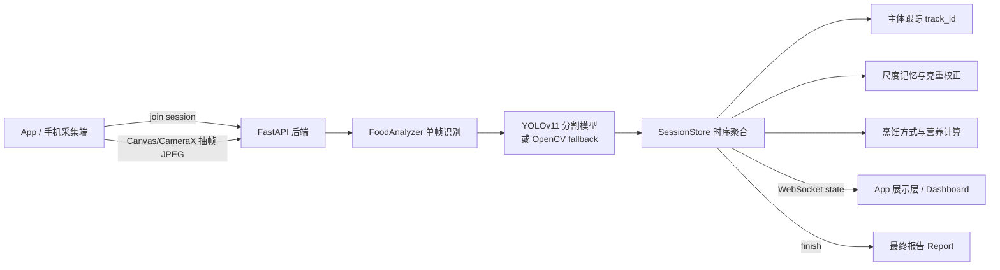
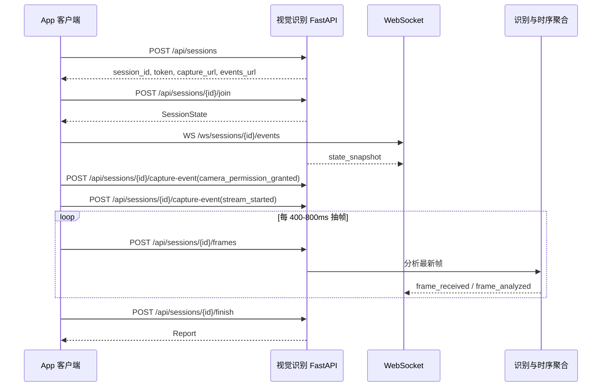

# 视觉识别板块技术接入文档

版本：v0.1
日期：2026-06-27
适用范围：慢慢养 App 接入“长时间视频食物识别、克重估算、营养反馈”视觉板块
当前实现目录：`demo/`

## 1. 模块定位

视觉识别板块负责从手机摄像头持续采集食物画面，完成食物主体识别、实例分割、连续跟踪、克重估算、烹饪方式识别、营养计算，并输出可用于 App 展示和报告生成的结构化结果。

它不是单张照片识别模块。当前方案以长时间视频抽帧为输入，通过多帧历史记忆降低单帧误差，尤其处理手机距离变化导致的克重漂移问题。

核心能力：

1. 创建一次性识别会话和 token。
2. 手机端加入会话并授权摄像头。
3. 手机端按固定频率抽取视频帧，上传 JPEG。
4. 后端实时分析最新帧，并通过 WebSocket 推送状态。
5. 对同一食物主体维护 `track_id`，连续修正克重。
6. 识别烹饪方式，并修正热量、脂肪、碳水、钠等营养估算。
7. 使用历史稳定帧做尺度基准，抑制镜头拉近/拉远造成的克重变化。
8. 结束采集后生成最终报告。

## 2. 当前技术栈

后端：

- Python 3
- FastAPI
- Uvicorn
- Pydantic
- OpenCV / numpy / Pillow
- 可选 Ultralytics YOLOv11 segmentation

前端 Demo：

- PC Dashboard：`demo/static/dashboard.html`
- 手机采集页：`demo/static/capture.html`
- 手机采集逻辑：`demo/static/capture.js`
- Dashboard 实时展示：`demo/static/dashboard.js`

算法服务：

- `demo/backend/services/analyzer.py`
- `demo/backend/services/session_store.py`
- `demo/backend/services/nutrition.py`

数据模型：

- `demo/backend/models/schemas.py`

启动入口：

- 本地 App/手机联调推荐：`demo/run_dual.py`
- HTTP 单端口调试：`demo/run_http.py`
- HTTPS 单端口调试：`demo/run_https.py`

## 3. 系统架构



## 4. 推荐 App 接入方式

### 4.1 第一阶段：WebView 快速接入

最短路径是 App 内打开后端返回的 `capture_url`，直接复用当前 H5 采集页。

优点：

- 接入最快。
- 当前 Demo 已验证 Android 摄像头授权和 JPEG 抽帧。
- App 只需要承载 WebView 或跳转系统浏览器。

限制：

- 摄像头能力受 WebView 内核和 HTTPS 策略影响。
- 帧率、对焦、曝光、机型兼容控制弱于原生。
- 对后续产品化 UI 和权限体验不够理想。

适用：内部演示、POC、短期测试。

### 4.2 第二阶段：原生 App 接入

正式 App 建议用原生相机能力替代 H5 采集页：

Android 推荐：

- CameraX 获取后置摄像头预览。
- 固定采集横向 640px 左右的 JPEG 帧。
- JPEG 质量建议 0.60-0.70。
- 上传频率建议 1.5-2.5 FPS，当前 H5 为约 520ms 一帧。
- 使用 REST 上传帧，使用 WebSocket 接收识别状态。

iOS 推荐：

- AVFoundation 获取后置摄像头预览。
- 输出 JPEG 或 HEIF 转 JPEG 后上传。
- 保持与 Android 一致的帧宽、频率和压缩质量。

原生接入优点：

- 权限体验可控。
- 可控制对焦、曝光、防抖、横竖屏。
- 可上传陀螺仪、加速度计、焦距、相机内参等数据，为后续 3D/尺度标定升级做准备。

## 5. App 端接入流程



## 6. 采集端要求

### 6.1 视频帧规格

当前建议：

- 图像格式：JPEG data URL 或 base64 JPEG。
- 推荐宽度：640px。
- 高度：按原始视频比例等比缩放。
- JPEG 质量：0.60-0.70。
- 上传频率：约 2 FPS。
- 单帧大小：建议控制在 50-180KB。

当前 H5 实现：

- `targetWidth = Math.min(640, video.videoWidth)`
- JPEG 质量 `0.62`
- 上传间隔 `520ms`

后端会在分析繁忙时只保留最新待分析帧，避免旧帧堆积导致延迟。

### 6.2 HTTPS 要求

Android 真机访问非 localhost 页面时，摄像头授权通常要求安全上下文。

本地测试：

- PC Dashboard：`http://127.0.0.1:8000`
- 手机采集：`https://{电脑局域网IP}:8443/capture?...`
- 使用 `python scripts/generate_dev_cert.py` 生成自签证书。
- 首次访问手机需要信任证书或继续访问。

生产环境：

- 必须使用正式 HTTPS 域名。
- 建议通过网关或 Nginx 转发到 FastAPI。
- 转发时保留 `x-forwarded-host` 和 `x-forwarded-proto`，后端会用它们生成正确的 `capture_url`。

## 7. 后端识别链路

### 7.1 单帧识别

`FoodAnalyzer` 对每帧输出候选食物主体：

1. 优先加载 YOLOv11 segmentation 模型。
2. 如果模型不可用，使用 OpenCV fallback。
3. 输出食物类别、bbox、polygon/mask、单帧体积、单帧克重、置信度。
4. 对明显非食物场景进行拒识。
5. 对主体烹饪方式进行初步识别。

模型加载规则：

- 默认路径：`demo/models/yolo11n-seg.pt`
- 可通过环境变量指定：`FOOD_MODEL_PATH=...`
- 不存在模型时自动回退 OpenCV fallback。

### 7.2 时序聚合

`SessionStore` 负责将单帧识别结果合并为稳定结果：

1. 根据 bbox IoU、中心距离、类别兼容度匹配历史主体。
2. 为每个主体维护稳定 `track_id`。
3. 用 EMA 和中位数降低单帧抖动。
4. 丢失主体短时间内保留，超过阈值移除。
5. 只输出主要食物主体，抑制远景碎片和包装、桌面等误识别。

### 7.3 尺度记忆与距离校正

当前版本已加入尺度校正，解决“镜头拉近导致克重变大”的问题。

单帧算法会输出：

- `raw_weight_g`：当前帧原始估重。
- `area_ratio`：食物 mask 占整帧比例。
- `bbox_area_ratio`：bbox 占整帧比例。
- `scale_view_quality`：当前帧是否适合作为尺度基准。

会话层只让满足条件的稳定帧进入尺度基准：

- 主体完整。
- 占屏不过大也不过小。
- 未明显贴边裁切。
- 视角质量达到阈值。
- 与历史尺度面积比例在可接受范围内。

当镜头明显拉近或拉远：

- 当前帧仍用于主体识别。
- 当前帧不更新克重基准。
- 展示克重使用历史稳定尺度校正。
- 返回 `scale_corrected=true`。
- `scale_status` 返回 `too_close` 或 `too_far`。

App 展示建议：

- 主展示使用 `estimated_weight_g`。
- 小字或调试态展示 `raw_weight_g`。
- 当 `scale_corrected=true` 时显示“已按历史尺度校正”。
- 当 `scale_status=too_close` 时提示用户稍微后退。
- 当 `scale_status=too_far` 时提示用户靠近并保持主体居中。

## 8. 营养计算

营养数据库在 `demo/backend/services/nutrition.py`。

当前包含 64 种常见中餐食材/菜品 profile，字段包括：

- 密度 `density_g_per_ml`
- 密度标准差 `density_std_g_per_ml`
- 每 100g 热量
- 每 100g 蛋白质
- 每 100g 碳水
- 每 100g 脂肪
- 膳食纤维
- 钠

计算链路：

```text
食物分割面积
  -> 近似体积 volume_ml
  -> 食物密度换算 estimated_weight_g
  -> 按 100g 营养表换算 nutrition
  -> 根据 cooking_method 做烹饪方式修正
```

当前支持的烹饪方式 key：

- `unknown`
- `raw_light`
- `boiled_steamed`
- `stir_fried`
- `pan_fried`
- `deep_fried`
- `braised`
- `roasted`

例如 `deep_fried` 会增加热量、脂肪、碳水和钠估算。

## 9. App UI 展示建议

实时采集页建议展示：

- 相机实时预览。
- 识别主体框/轮廓。
- 当前识别主体名称。
- 当前克重和误差，例如 `129 ± 12g`。
- 烹饪方式，例如 `炸制`。
- 采集质量或收敛度。
- 引导语 `guidance.message`。
- 结束采集按钮。

结果页建议展示：

- 总重量。
- 总热量。
- 总蛋白质、碳水、脂肪。
- 食物列表。
- 每个食物的克重、误差、置信度、烹饪方式。
- 采集质量和注意事项。

对用户的产品表达建议：

- 使用“估算”而不是“称重”。
- 展示误差和置信度。
- 提示“继续绕餐盘缓慢移动可降低误差”。
- 对尺度校正场景提示“已按历史稳定帧校正”。

## 10. 本地启动与测试

安装依赖：

```powershell
cd F:\泉客松\wo-xi\demo
python -m pip install -r requirements.txt
```

生成本地 HTTPS 证书：

```powershell
python scripts/generate_dev_cert.py
```

启动 HTTP Dashboard 和 HTTPS 手机采集：

```powershell
python run_dual.py
```

打开 Dashboard：

```text
http://127.0.0.1:8000
```

手机与电脑连接同一 Wi-Fi，扫描 Dashboard 二维码，或打开 `capture_url`。

健康检查：

```text
GET http://127.0.0.1:8000/health
```

## 11. 生产化改造建议

当前 demo 是本地联调版本，接入 App 前建议逐步做以下改造：

1. 会话和 token 改为服务端签发的短期凭证，或接入 App 登录态。
2. 图片帧上传改为二进制 multipart 或 WebSocket binary，降低 base64 开销。
3. 推流链路可升级为 WebRTC/SFU，再由后端抽帧分析。
4. 模型换成 food 专用 segmentation/recognition 模型。
5. 建立真实称重标注数据集，用于校准密度、体积和误差模型。
6. 增加标准参考物方案，例如标准餐盘、餐盒、银行卡大小标定卡。
7. 原生 App 上传相机参数、焦距、设备姿态，支持更可靠的尺度估计。
8. 报告持久化到业务数据库。
9. 图片处理链路增加隐私策略、过期清理和访问鉴权。
10. 对不同机型建立采集质量基线。

## 12. 当前边界

当前版本可用于 App 接入联调和产品验证，但不应作为医疗级或精确称重能力宣传。

主要边界：

- 普通 RGB 视频无法直接得到真实重量。
- 混合菜、汤汁、遮挡、反光容器仍会影响估重。
- 食材类别依赖当前模型和营养数据库。
- 烹饪方式识别是工程估算，仍需要后续模型化训练。
- 本地自签 HTTPS 仅用于测试，生产必须使用正式证书。
