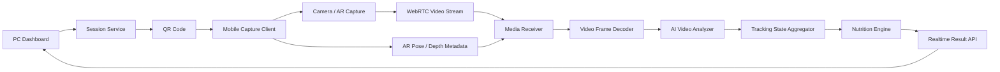
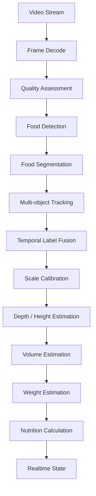

# 基于长时间视频的食物克重识别与实时营养反馈系统技术文档

版本：v0.1  
日期：2026-06-27  
定位：第一版可落地技术方案  
目标：通过手机摄像头长时间视频采集，对食物进行实时识别、连续跟踪、体积估算、克重估算、营养计算，并在可视化面板中实时反馈。

---

## 1. 项目目标

本项目要实现的不是普通的“拍照识别食物”，而是一个以手机摄像头为持续视觉传感器的实时食物测量系统。

第一版目标：

1. 用户在电脑端打开可视化面板。
2. 系统生成二维码。
3. 用户用手机扫码加入当前识别会话。
4. 手机授权摄像头，并持续传输视频流。
5. 后端或媒体服务持续接收视频。
6. AI 分析服务对视频进行食物识别、实例分割和连续跟踪。
7. 系统基于多角度视频、尺度标定、深度信息或近似深度估计，计算食物体积。
8. 系统根据食物类别和密度模型，将体积换算为克重。
9. 系统根据克重和营养数据库计算热量、蛋白质、碳水、脂肪等信息。
10. 可视化面板实时展示摄像头画面、食物分割区域、克重、营养信息、置信度和测量质量。

一句话定义：

> 基于手机长时间视频流的食物连续识别、实时估重和营养反馈系统。

---

## 2. 关键原则

### 2.1 不使用单次拍照作为核心输入

本系统不以“拍一张照片上传识别”为核心流程，而是使用连续视频作为主要信息来源。

视频方案的价值：

- 可获取多角度信息。
- 可持续跟踪同一食物。
- 可观察食物区域随视角变化的轮廓。
- 可根据用户移动手机的轨迹估算尺度和深度。
- 可实时判断当前采集质量是否足够。
- 可引导用户补充缺失角度。
- 后续可扩展吃前、吃中、吃后对比。

### 2.2 克重估算必须依赖测量链路

克重不能由视觉大模型直接“猜”出来。合理链路是：

```text
视频流
  -> 食物识别
  -> 食物分割
  -> 连续跟踪
  -> 尺度标定
  -> 深度 / 3D / 高度图估计
  -> 体积估算
  -> 密度换算
  -> 克重估算
  -> 营养计算
```

### 2.3 输出具体克重，但必须同时输出置信度和误差

产品层可以显示：

```text
米饭 168g
鸡胸肉 92g
西兰花 64g
```

但数据层必须同时保存：

```text
米饭 168g，预计误差 ±21g，置信度 0.86
鸡胸肉 92g，预计误差 ±14g，置信度 0.78
西兰花 64g，预计误差 ±20g，置信度 0.62
```

原因：

- 普通 RGB 视频无法天然获得真实重量。
- 不同食物密度差异很大。
- 混合菜、汤汁、油脂、遮挡会显著影响结果。
- 没有置信度的“精确克重”会造成错误产品承诺。

### 2.4 第一版必须限定场景

第一版不做“所有食物全场景精准估重”。推荐第一版限定：

- 标准餐盘。
- 标准碗。
- 标准备餐盒。
- 常见健身餐。
- 常见主食、蛋白质、蔬菜。
- 光照正常。
- 用户愿意按引导移动手机 15-30 秒。

第一版弱化：

- 火锅。
- 麻辣烫。
- 汤。
- 粥。
- 大量酱汁。
- 油炸食物。
- 复杂混合中餐。
- 被严重遮挡的食物。
- 透明或强反光容器。

---

## 3. 第一版能力范围

### 3.1 必须实现

1. 二维码创建识别会话。
2. 手机扫码加入会话。
3. 手机端授权摄像头。
4. 手机端持续视频推流。
5. 后端或媒体服务接收视频流。
6. 实时可视化面板显示摄像头画面。
7. AI 识别画面中的食物类别。
8. AI 分割食物区域。
9. 系统对同一食物进行连续跟踪，维护 track_id。
10. 系统估算每个食物的体积。
11. 系统将体积换算为克重。
12. 系统计算营养信息。
13. 面板实时显示克重、营养、置信度、测量质量。
14. 系统给出采集引导，例如向左移动、降低角度、保持稳定。
15. 系统输出最终报告。

### 3.2 暂不实现

1. 医疗级精确称重。
2. 所有中餐自动拆分配方。
3. 所有手机型号同等精度。
4. 无标定情况下精准到克。
5. 不看侧面也能准确估算体积。
6. 自动识别隐藏在底部的食物。
7. 完全无误差的油脂估计。
8. 长期个人饮食历史管理。
9. 支付、账号、社交等非核心功能。

---

## 4. 推荐技术路线

第一版推荐使用：

```text
PC Web Dashboard
  + 二维码会话
  + 手机 Web / App 视频采集
  + WebRTC 视频传输
  + WebSocket 信令
  + 后端视频接收
  + AI 视频分析服务
  + 实时状态聚合
  + 可视化反馈面板
```

如果目标是最快原型：

```text
手机浏览器 getUserMedia
  -> WebRTC
  -> PC Dashboard / 后端媒体服务
  -> AI 低频分析
```

如果目标是更接近精准克重：

```text
移动端原生 App / React Native / Flutter
  -> 摄像头 RGB 视频
  -> ARKit / ARCore 位姿和深度
  -> WebRTC 或 WebSocket 数据通道
  -> 后端 AI 分析
```

本技术文档建议采用第二种方向作为产品底座：

```text
手机端采集 RGB 视频 + 可选 AR 深度/位姿
后端进行实时 AI 分析
电脑端显示实时面板
```

---

## 5. 总体架构



核心模块：

1. PC Dashboard：电脑端可视化面板。
2. Session Service：会话、二维码、token、权限状态。
3. Mobile Capture Client：手机采集端。
4. Signaling Server：WebRTC 信令服务。
5. Media Receiver：视频接收服务。
6. AI Video Analyzer：AI 视频分析服务。
7. Tracking State Aggregator：持续状态聚合服务。
8. Nutrition Engine：营养计算服务。
9. Realtime Result API：实时结果推送服务。

---

## 6. 系统工作流

### 6.1 会话创建

```text
用户打开 PC Dashboard
  -> 点击新建测量
  -> 后端创建 session
  -> 生成一次性 token
  -> 生成二维码
  -> Dashboard 显示二维码
```

二维码内容示例：

```text
https://example.com/capture?session_id=sess_20260627_001&token=once_xxx
```

session 示例：

```json
{
  "session_id": "sess_20260627_001",
  "token_hash": "sha256_xxx",
  "status": "waiting_mobile",
  "created_at": "2026-06-27T15:00:00+08:00",
  "expires_at": "2026-06-27T15:10:00+08:00"
}
```

### 6.2 手机扫码连接

```text
手机扫码
  -> 打开采集页或 App
  -> 提交 session_id 和 token
  -> 后端校验 token
  -> session 状态变为 mobile_connected
  -> 手机请求摄像头权限
```

### 6.3 摄像头和 AR 采集

手机端采集：

- RGB 视频。
- 时间戳。
- 设备姿态。
- 可选相机内参。
- 可选深度图。
- 可选 AR 平面。
- 可选 LiDAR 数据。

采集频率建议：

```text
RGB 视频：24-30 FPS
AI 分析帧：1-5 FPS
语义大模型确认：每 3-10 秒一次
实时状态推送：每 300-1000 ms 一次
```

### 6.4 视频持续分析

```text
视频流进入服务端
  -> 解码视频帧
  -> 检测画面质量
  -> 识别食物类别
  -> 分割食物区域
  -> 跟踪同一食物
  -> 融合多帧结果
  -> 估算体积
  -> 换算克重
  -> 计算营养
  -> 推送 Dashboard
```

### 6.5 结束测量

结束条件：

- 用户点击结束。
- 系统判断测量质量达到阈值。
- 视频时长达到上限。
- 连接断开。

最终报告包含：

- 食物清单。
- 每种食物克重。
- 体积。
- 热量。
- 蛋白质。
- 碳水。
- 脂肪。
- 置信度。
- 误差估计。
- 扫描质量。
- 风险提示。

---

## 7. 手机端设计

### 7.1 手机端形式

第一版有两种实现方式：

#### 方案 A：手机浏览器

优点：

- 扫码即用。
- 不需要安装 App。
- 原型速度快。

缺点：

- 深度、AR 位姿、相机内参能力有限。
- iOS 和 Android 浏览器能力不一致。
- HTTPS 要求严格。
- 精准克重能力受限。

#### 方案 B：原生 App 或跨端 App

优点：

- 可使用 ARKit / ARCore。
- 可读取深度、相机位姿、相机内参。
- 视频采集和传输更稳定。
- 更适合克重估算。

缺点：

- 开发成本更高。
- 需要安装 App。

本项目建议：

```text
技术验证早期可以使用浏览器。
克重版本建议使用原生 App 或跨端 App + 原生 AR 模块。
```

### 7.2 手机端页面状态

手机端状态：

```text
initializing
validating_session
requesting_camera_permission
camera_ready
streaming
measuring
need_more_angle
completed
error
```

### 7.3 手机端用户引导

引导文案示例：

```text
请将餐盘完整放入画面
请缓慢向左移动手机
请稍微降低角度，拍到食物侧面
请保持稳定 2 秒
已获得足够信息，正在生成结果
```

### 7.4 采集参数建议

RGB 视频：

```json
{
  "width": 1280,
  "height": 720,
  "fps": 30,
  "camera": "back",
  "codec": "H264"
}
```

AR 数据：

```json
{
  "camera_intrinsics": true,
  "camera_pose": true,
  "plane_detection": true,
  "depth_map": true,
  "timestamp_sync": true
}
```

---

## 8. 视频传输方案

### 8.1 WebRTC

推荐使用 WebRTC 传输手机摄像头视频。

原因：

- 原生支持实时媒体传输。
- 延迟低。
- 适合长时间视频连接。
- 支持浏览器和原生端。
- 支持 NAT 穿透。
- 可扩展 DataChannel 发送元数据。

### 8.2 信令服务

WebRTC 需要信令交换：

- offer。
- answer。
- ICE candidate。
- session token。
- client role。

信令通道建议使用 WebSocket。

信令消息示例：

```json
{
  "type": "webrtc_offer",
  "session_id": "sess_20260627_001",
  "role": "mobile_capture",
  "sdp": "..."
}
```

```json
{
  "type": "ice_candidate",
  "session_id": "sess_20260627_001",
  "candidate": {
    "candidate": "...",
    "sdpMid": "0",
    "sdpMLineIndex": 0
  }
}
```

### 8.3 媒体接收方案

可选方案：

1. aiortc：Python 原型友好，方便接 OpenCV / PyTorch。
2. LiveKit：更接近生产，房间、订阅、录制能力完整。
3. mediasoup：Node.js 生态强，适合自建媒体服务。
4. Pion：Go 语言实现，性能好，工程稳定。

第一版推荐：

```text
原型：FastAPI + aiortc
生产化：LiveKit 或 mediasoup
```

---

## 9. AI 视频分析 Pipeline

### 9.1 总体流程



### 9.2 画面质量检测

检测指标：

- 模糊程度。
- 光照质量。
- 运动速度。
- 餐盘完整度。
- 食物是否被遮挡。
- 手机是否移动过快。
- 是否有强反光。

输出示例：

```json
{
  "blur": "low",
  "lighting": "good",
  "motion": "slow",
  "plate_visibility": 0.92,
  "occlusion": "low",
  "overall_quality": 0.84
}
```

### 9.3 食物检测

目标：

```text
找出画面中可能是食物的区域。
```

输出：

```json
{
  "bbox": [120, 180, 360, 420],
  "class_candidate": "food",
  "confidence": 0.91
}
```

可选模型：

- YOLOv8 / YOLOv10 detection。
- RT-DETR。
- Grounding DINO。
- 自训练 food detector。

### 9.4 食物实例分割

目标：

```text
给每个食物对象生成 mask。
```

输出：

```json
{
  "mask_id": "mask_001",
  "bbox": [120, 180, 360, 420],
  "area_px": 48215,
  "confidence": 0.88
}
```

可选模型：

- YOLO segmentation。
- Mask2Former。
- SAM / MobileSAM。
- SAM2 视频分割。
- 自训练 food segmentation。

第一版建议：

```text
通用分割模型 + 食物识别模型组合
```

后续优化：

```text
使用自采集食物数据训练专用分割模型
```

### 9.5 食物语义识别

目标：

```text
判断每个分割区域对应的具体食物名称。
```

输出：

```json
{
  "name": "米饭",
  "category": "主食",
  "confidence": 0.93
}
```

模型组合：

1. 食物分类模型：快速、低成本。
2. 视觉大模型：复杂菜品确认。
3. 多帧语义融合：降低误判。

不建议：

```text
每帧都调用大模型。
```

建议策略：

```text
轻模型高频处理
大模型低频确认
时间融合稳定结果
```

### 9.6 多目标跟踪

目标：

```text
让系统知道当前帧的某个食物，与前几秒看到的是同一个对象。
```

每个食物维护：

- track_id。
- label 候选分布。
- bbox 历史。
- mask 历史。
- 面积历史。
- 深度历史。
- 可见时长。
- 稳定性。

匹配依据：

- bbox IoU。
- mask IoU。
- 颜色特征。
- 纹理特征。
- 外观 embedding。
- 光流。
- 深度连续性。
- 空间位置连续性。

track 示例：

```json
{
  "track_id": "food_1",
  "current_label": "米饭",
  "label_scores": {
    "米饭": 0.91,
    "粥": 0.06,
    "土豆泥": 0.03
  },
  "visible_seconds": 18.4,
  "tracking_stability": 0.89,
  "last_seen_frame": 542
}
```

### 9.7 时间融合

视频识别的核心优势是时间累计。

单帧结果可能抖动：

```text
第 1 秒：鸡肉
第 2 秒：鸡胸肉
第 3 秒：烤鸡
第 4 秒：鸡排
```

融合后：

```text
鸡胸肉 / 鸡肉类，置信度 0.86
```

简单融合公式：

```text
score_t = score_(t-1) * alpha + current_score * (1 - alpha)
```

建议：

```text
alpha = 0.75 - 0.90
```

---

## 10. 克重估算方案

### 10.1 克重估算总链路

```text
食物 mask
  + 真实尺度
  + 深度 / 高度图
  -> 体积 ml
  + 食物密度 g/ml
  -> 克重 g
```

公式：

```text
weight_g = volume_ml * density_g_per_ml
```

### 10.2 尺度标定

没有真实尺度，无法可靠估算克重。

尺度来源优先级：

1. ARKit / ARCore 相机位姿和空间尺度。
2. LiDAR / ToF 深度。
3. 标准餐盘 / 标准碗 / 标准备餐盒。
4. 标定餐垫 / AprilTag / ArUco marker。
5. 用户手动输入容器尺寸。
6. 纯视觉估计。

第一版建议至少支持：

```text
标准餐盘尺寸
用户手动输入餐盘直径
标定餐垫 / 标定卡
```

更强版本支持：

```text
ARKit / ARCore 平面检测和深度
```

### 10.3 深度与高度估算

推荐方式：

```text
多角度视频 + 相机位姿 + 食物 mask + 深度图
```

简化流程：

1. 检测餐盘或桌面平面。
2. 将平面作为高度基准。
3. 对食物区域生成深度图。
4. 对齐多帧深度。
5. 生成食物高度图。
6. 积分计算体积。

体积积分：

```text
V = sum(height(x, y) * grid_area)
```

### 10.4 体积估算

每个 track 输出：

```json
{
  "track_id": "food_1",
  "volume_ml": 234,
  "volume_confidence": 0.84,
  "height_map_quality": 0.81,
  "angle_coverage": 0.76
}
```

### 10.5 食物密度库

示例：

```json
{
  "米饭": {
    "density_mean_g_per_ml": 0.72,
    "density_std_g_per_ml": 0.08,
    "calories_per_100g": 116,
    "protein_per_100g": 2.6,
    "carbs_per_100g": 25.9,
    "fat_per_100g": 0.3
  },
  "鸡胸肉": {
    "density_mean_g_per_ml": 1.02,
    "density_std_g_per_ml": 0.06,
    "calories_per_100g": 165,
    "protein_per_100g": 31.0,
    "carbs_per_100g": 0,
    "fat_per_100g": 3.6
  },
  "西兰花": {
    "density_mean_g_per_ml": 0.40,
    "density_std_g_per_ml": 0.10,
    "calories_per_100g": 34,
    "protein_per_100g": 2.8,
    "carbs_per_100g": 6.6,
    "fat_per_100g": 0.4
  }
}
```

### 10.6 误差估计

误差来源：

- 分割误差。
- 深度误差。
- 尺度误差。
- 密度误差。
- 遮挡误差。
- 混合菜成分比例误差。

简单误差合成：

```text
relative_error =
  segmentation_error
  + depth_error
  + scale_error
  + density_error
  + occlusion_error
```

输出：

```json
{
  "estimated_weight_g": 168,
  "weight_error_g": 21,
  "weight_confidence": 0.86
}
```

---

## 11. 营养计算

### 11.1 营养数据结构

营养库按每 100g 记录：

```json
{
  "food_id": "rice_cooked",
  "display_name": "熟米饭",
  "calories_kcal_per_100g": 116,
  "protein_g_per_100g": 2.6,
  "carbs_g_per_100g": 25.9,
  "fat_g_per_100g": 0.3,
  "fiber_g_per_100g": 0.4,
  "sodium_mg_per_100g": 1
}
```

### 11.2 计算公式

```text
calories = weight_g / 100 * calories_per_100g
protein = weight_g / 100 * protein_per_100g
carbs = weight_g / 100 * carbs_per_100g
fat = weight_g / 100 * fat_per_100g
```

### 11.3 混合菜处理

复杂菜品不要只输出一个固定营养值，建议拆成成分模型：

```json
{
  "name": "番茄炒蛋",
  "estimated_weight_g": 210,
  "components": [
    {
      "name": "鸡蛋",
      "ratio_min": 0.35,
      "ratio_max": 0.50
    },
    {
      "name": "番茄",
      "ratio_min": 0.40,
      "ratio_max": 0.60
    },
    {
      "name": "食用油",
      "ratio_min": 0.03,
      "ratio_max": 0.08
    }
  ]
}
```

用户可补充：

```text
少油 / 正常 / 多油
```

---

## 12. 实时可视化面板设计

### 12.1 面板布局

建议 PC Dashboard 分为四个区域：

1. 实时视频区。
2. 食物数据表。
3. 测量质量区。
4. 最终报告区。

### 12.2 实时视频区

功能：

- 显示手机摄像头画面。
- 叠加食物分割 mask。
- 叠加食物边界框。
- 显示 track_id。
- 显示食物名称。
- 显示实时估重。
- 显示置信度。

示例叠加：

```text
米饭 168g 86%
鸡胸肉 92g 78%
西兰花 64g 62%
```

### 12.3 食物数据表

字段：

```text
食物
track_id
克重
体积
热量
蛋白质
碳水
脂肪
置信度
误差
状态
```

示例：

```text
食物      克重   体积    热量     蛋白质   碳水    脂肪   置信度
米饭      168g   234ml   195kcal  4.4g    43.5g  0.5g   86%
鸡胸肉    92g    90ml    152kcal  28.4g   0g     3.3g   78%
西兰花    64g    160ml   22kcal   1.8g    4.2g   0.3g   62%
```

### 12.4 测量质量区

指标：

- 视频时长。
- 有效视角覆盖。
- 深度完整度。
- 分割稳定性。
- 遮挡程度。
- 光照质量。
- 运动质量。
- 是否检测到标定物。
- 是否检测到餐盘完整边界。

示例：

```json
{
  "duration_sec": 22.7,
  "angle_coverage": 0.84,
  "depth_quality": 0.79,
  "segmentation_stability": 0.88,
  "lighting": "good",
  "occlusion": "low",
  "overall": 0.81
}
```

### 12.5 用户引导区

根据实时质量输出指令：

```text
请向右移动手机，以补充右侧食物视角
请降低手机角度，获取食物高度
请保持稳定 2 秒
请将餐盘完整放入画面
光照不足，请靠近光源
```

---

## 13. 实时状态数据结构

Dashboard 实时接收的状态示例：

```json
{
  "session_id": "sess_20260627_001",
  "status": "measuring",
  "elapsed_seconds": 18.4,
  "video": {
    "fps": 28,
    "resolution": "1280x720",
    "quality": "good"
  },
  "measurement_quality": {
    "angle_coverage": 0.72,
    "depth_completeness": 0.81,
    "mask_stability": 0.88,
    "motion_quality": "good",
    "lighting": "good",
    "overall": 0.79
  },
  "foods": [
    {
      "track_id": "food_1",
      "name": "米饭",
      "category": "主食",
      "state": "stable",
      "bbox": [120, 180, 360, 420],
      "confidence": 0.91,
      "volume_ml": 234,
      "volume_confidence": 0.84,
      "density_g_per_ml": 0.72,
      "estimated_weight_g": 168,
      "weight_error_g": 21,
      "weight_confidence": 0.86,
      "nutrition": {
        "calories_kcal": 195,
        "protein_g": 4.4,
        "carbs_g": 43.5,
        "fat_g": 0.5
      }
    }
  ],
  "guidance": {
    "message": "请向右移动手机，以补充侧面视角。",
    "needed_action": "move_right"
  }
}
```

---

## 14. API 设计

### 14.1 创建会话

```http
POST /api/sessions
```

响应：

```json
{
  "session_id": "sess_20260627_001",
  "capture_url": "https://example.com/capture?session_id=sess_20260627_001&token=once_xxx",
  "qr_code_url": "/api/sessions/sess_20260627_001/qrcode",
  "expires_at": "2026-06-27T15:10:00+08:00"
}
```

### 14.2 手机加入会话

```http
POST /api/sessions/{session_id}/join
```

请求：

```json
{
  "token": "once_xxx",
  "device": {
    "platform": "ios",
    "model": "iPhone",
    "app_version": "0.1.0"
  }
}
```

响应：

```json
{
  "ok": true,
  "session_status": "mobile_connected",
  "webrtc_signaling_url": "wss://example.com/ws/signaling",
  "result_events_url": "wss://example.com/ws/sessions/sess_20260627_001/events"
}
```

### 14.3 WebRTC 信令

```text
WS /ws/signaling
```

消息类型：

- session_joined。
- webrtc_offer。
- webrtc_answer。
- ice_candidate。
- stream_started。
- stream_stopped。
- error。

### 14.4 获取实时状态

```http
GET /api/sessions/{session_id}/state
```

响应：

```json
{
  "session_id": "sess_20260627_001",
  "status": "measuring",
  "foods": []
}
```

### 14.5 实时事件推送

```text
WS /ws/sessions/{session_id}/events
```

事件类型：

- mobile_connected。
- camera_permission_granted。
- stream_started。
- frame_quality_updated。
- food_detected。
- food_updated。
- measurement_quality_updated。
- guidance_updated。
- measurement_completed。
- error。

### 14.6 结束测量

```http
POST /api/sessions/{session_id}/finish
```

响应：

```json
{
  "status": "completed",
  "report_id": "report_001"
}
```

### 14.7 获取最终报告

```http
GET /api/reports/{report_id}
```

响应：

```json
{
  "report_id": "report_001",
  "meal_summary": {
    "total_weight_g": 324,
    "total_calories_kcal": 369,
    "total_protein_g": 34.6,
    "total_carbs_g": 47.7,
    "total_fat_g": 4.1,
    "overall_confidence": 0.81
  },
  "foods": []
}
```

---

## 15. 数据库设计

### 15.1 sessions

```sql
CREATE TABLE sessions (
  id TEXT PRIMARY KEY,
  status TEXT NOT NULL,
  token_hash TEXT NOT NULL,
  created_at TIMESTAMP NOT NULL,
  expires_at TIMESTAMP NOT NULL,
  started_at TIMESTAMP,
  completed_at TIMESTAMP
);
```

### 15.2 food_tracks

```sql
CREATE TABLE food_tracks (
  id TEXT PRIMARY KEY,
  session_id TEXT NOT NULL,
  label TEXT,
  category TEXT,
  confidence REAL,
  first_seen_at TIMESTAMP,
  last_seen_at TIMESTAMP,
  visible_seconds REAL,
  tracking_stability REAL,
  current_state TEXT
);
```

### 15.3 measurements

```sql
CREATE TABLE measurements (
  id TEXT PRIMARY KEY,
  session_id TEXT NOT NULL,
  track_id TEXT NOT NULL,
  volume_ml REAL,
  volume_confidence REAL,
  density_g_per_ml REAL,
  estimated_weight_g REAL,
  weight_error_g REAL,
  weight_confidence REAL,
  created_at TIMESTAMP NOT NULL
);
```

### 15.4 nutrition_results

```sql
CREATE TABLE nutrition_results (
  id TEXT PRIMARY KEY,
  session_id TEXT NOT NULL,
  track_id TEXT NOT NULL,
  calories_kcal REAL,
  protein_g REAL,
  carbs_g REAL,
  fat_g REAL,
  fiber_g REAL,
  sodium_mg REAL
);
```

### 15.5 food_nutrition_profiles

```sql
CREATE TABLE food_nutrition_profiles (
  id TEXT PRIMARY KEY,
  display_name TEXT NOT NULL,
  category TEXT,
  density_mean_g_per_ml REAL,
  density_std_g_per_ml REAL,
  calories_kcal_per_100g REAL,
  protein_g_per_100g REAL,
  carbs_g_per_100g REAL,
  fat_g_per_100g REAL,
  fiber_g_per_100g REAL,
  sodium_mg_per_100g REAL
);
```

---

## 16. 推荐工程栈

### 16.1 前端

```text
Next.js / React
TypeScript
WebSocket client
WebRTC client
Canvas / WebGL overlay
ECharts / Recharts for charts
```

### 16.2 手机端

早期原型：

```text
Mobile Web
getUserMedia
WebRTC
```

克重版本：

```text
React Native / Flutter / Native iOS / Native Android
ARKit / ARCore
WebRTC SDK
Depth API
Camera intrinsics
```

### 16.3 后端

```text
FastAPI
Python
aiortc
OpenCV
PyTorch / ONNX Runtime
Redis
PostgreSQL
```

### 16.4 媒体服务

原型：

```text
aiortc
```

生产：

```text
LiveKit / mediasoup / Pion
```

### 16.5 AI 模型

```text
Food detector
Food segmentation model
Food classifier
Vision-language model for semantic confirmation
Depth estimation model
Tracking model / tracker
```

---

## 17. 第一版里程碑

### M1：二维码和会话

验收：

- Dashboard 可以创建 session。
- 可以生成二维码。
- 手机扫码后 session 状态变为 connected。

### M2：视频连接

验收：

- 手机可以授权摄像头。
- 手机可以持续推流 30 秒以上。
- Dashboard 可以看到实时视频。

### M3：基础识别

验收：

- 系统可以识别主要食物类别。
- 识别结果可以实时显示在 Dashboard。

### M4：分割和跟踪

验收：

- 系统可以显示食物 mask。
- 同一食物在视频中保持稳定 track_id。
- 食物短暂遮挡后可以恢复跟踪。

### M5：体积和克重

验收：

- 系统可以对限定食物输出体积 ml。
- 系统可以输出克重 g。
- 系统可以输出误差范围和置信度。

### M6：营养反馈

验收：

- 系统可以根据克重计算热量、蛋白质、碳水、脂肪。
- Dashboard 可以实时展示营养汇总。

### M7：最终报告

验收：

- 用户结束测量后生成报告。
- 报告包含食物明细、总重量、总热量、营养、置信度、风险提示。

---

## 18. 数据采集与校准计划

克重准确性依赖自有校准数据。

### 18.1 第一批数据

推荐：

```text
10 种食物
每种 10 个重量档位
每个档位 10 段视频
总计约 1000 段视频
```

食物建议：

```text
米饭
面条
鸡胸肉
牛肉块
鸡蛋
西兰花
土豆
红薯
玉米
苹果块
```

### 18.2 每条数据记录

```text
真实重量
真实体积
食物类别
餐具类型
餐具尺寸
手机型号
视频文件
深度数据
相机轨迹
光照条件
是否遮挡
分割标注
```

### 18.3 评估指标

```text
食物识别准确率
分割 IoU
track 稳定性
体积估算误差
克重估算误差
营养估算误差
测量完成率
平均测量时长
用户重试率
```

### 18.4 第一版精度目标

```text
标准餐盘 + 单一食物：重量误差 ±10%-15%
健身餐多食物：重量误差 ±15%-25%
复杂混合菜：重量误差 ±25%-50%
无标定或强遮挡：仅输出低置信度结果
```

---

## 19. 风险与对策

### 19.1 无法精确估重

风险：

```text
普通 RGB 视频缺少真实尺度和深度。
```

对策：

```text
引入标定餐垫、标准餐具、ARKit / ARCore、用户输入餐盘尺寸。
```

### 19.2 复杂菜品难以拆分

风险：

```text
番茄炒蛋、炒饭、盖浇饭等混合菜内部成分不可见。
```

对策：

```text
使用菜品模板 + 成分比例范围 + 用户轻量确认。
```

### 19.3 油脂无法从视觉准确判断

风险：

```text
油脂少量但热量高，视觉不稳定。
```

对策：

```text
加入少油/正常/多油交互，输出风险提示。
```

### 19.4 手机型号差异

风险：

```text
不同手机相机、深度、AR 能力差异明显。
```

对策：

```text
记录设备型号，做设备级校准；无深度设备降级为估算模式。
```

### 19.5 实时成本高

风险：

```text
每帧调用大模型会导致成本和延迟不可控。
```

对策：

```text
轻模型高频处理，大模型低频确认。
```

---

## 20. 第一版最终输出示例

```json
{
  "meal_summary": {
    "total_weight_g": 324,
    "total_calories_kcal": 369,
    "total_protein_g": 34.6,
    "total_carbs_g": 47.7,
    "total_fat_g": 4.1,
    "overall_confidence": 0.81
  },
  "foods": [
    {
      "name": "米饭",
      "weight_g": 168,
      "weight_error_g": 21,
      "volume_ml": 234,
      "calories_kcal": 195,
      "protein_g": 4.4,
      "carbs_g": 43.5,
      "fat_g": 0.5,
      "confidence": 0.86
    },
    {
      "name": "鸡胸肉",
      "weight_g": 92,
      "weight_error_g": 14,
      "volume_ml": 90,
      "calories_kcal": 152,
      "protein_g": 28.4,
      "carbs_g": 0,
      "fat_g": 3.3,
      "confidence": 0.78
    },
    {
      "name": "西兰花",
      "weight_g": 64,
      "weight_error_g": 20,
      "volume_ml": 160,
      "calories_kcal": 22,
      "protein_g": 1.8,
      "carbs_g": 4.2,
      "fat_g": 0.3,
      "confidence": 0.62
    }
  ],
  "scan_quality": {
    "duration_sec": 22.7,
    "angle_coverage": 0.84,
    "depth_quality": 0.79,
    "segmentation_stability": 0.88,
    "lighting": "good",
    "occlusion": "low"
  },
  "warnings": [
    "西兰花空隙较大，克重误差可能偏高",
    "未检测到明显酱汁或额外油脂"
  ]
}
```

---

## 21. 推荐落地顺序

建议按以下顺序开发：

1. 建立 Next.js Dashboard 原型。
2. 建立 session 和二维码服务。
3. 手机端扫码连接。
4. 跑通 WebRTC 视频流。
5. Dashboard 显示实时手机画面。
6. 接入基础食物识别模型。
7. 接入食物分割模型。
8. 实现 track_id 和时间融合。
9. 接入尺度标定。
10. 实现体积估算。
11. 建立食物密度库。
12. 实现克重估算。
13. 接入营养数据库。
14. 实现实时可视化面板。
15. 实现最终报告。
16. 开始采集真实称重数据进行校准。

---

## 22. 结论

这一版的核心不是“AI 看图识别食物”，而是：

> 用手机长时间视频流建立一个连续测量过程，通过识别、分割、跟踪、尺度标定、深度估计、体积估算和密度模型，实时输出食物克重与营养信息。

第一版必须坚持三点：

1. 以持续视频为核心输入，不以单张图片为核心输入。
2. 以测量链路估算克重，不让大模型直接猜重量。
3. 输出具体克重时，同时输出置信度、误差范围和测量质量。

建议第一版产品定义：

> 面向标准餐盘和常见食物的实时视频营养测量系统。

建议第一版验收目标：

```text
手机扫码连接
持续视频采集
实时 Dashboard
食物识别
食物分割
连续跟踪
体积估算
克重估算
营养反馈
测量质量提示
最终报告生成
```

